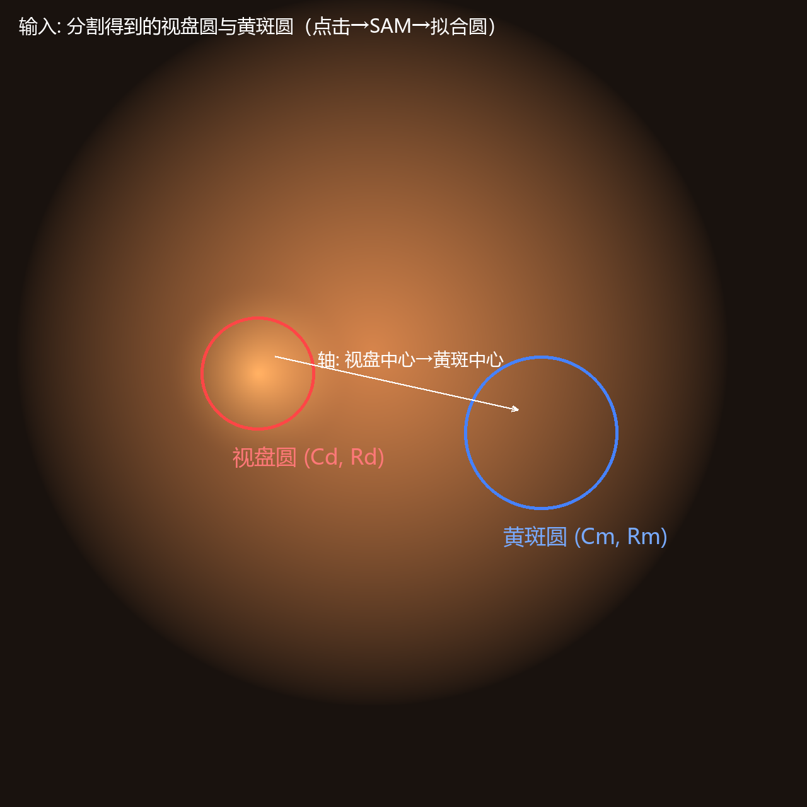
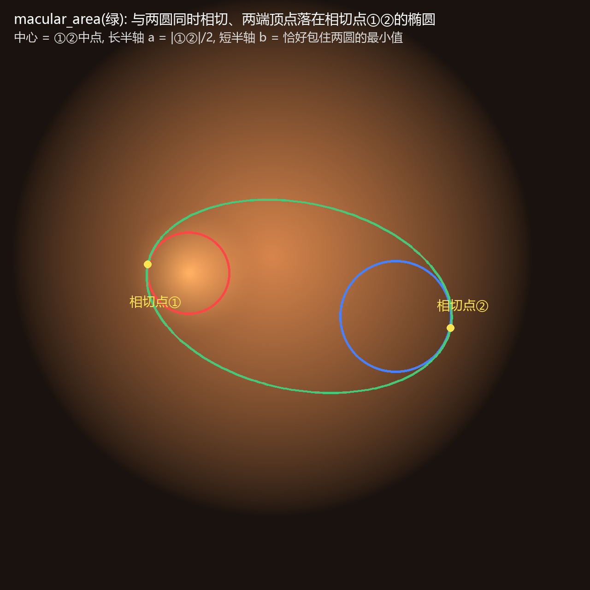
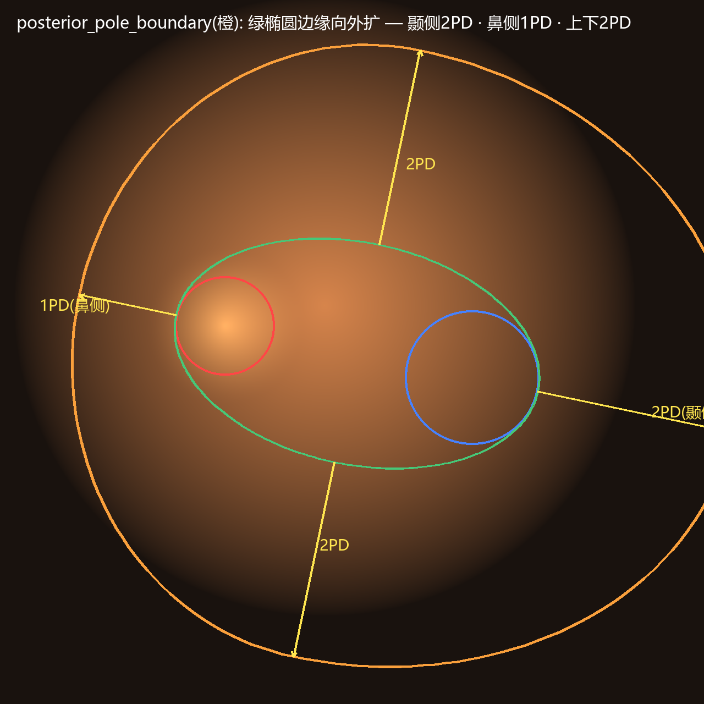
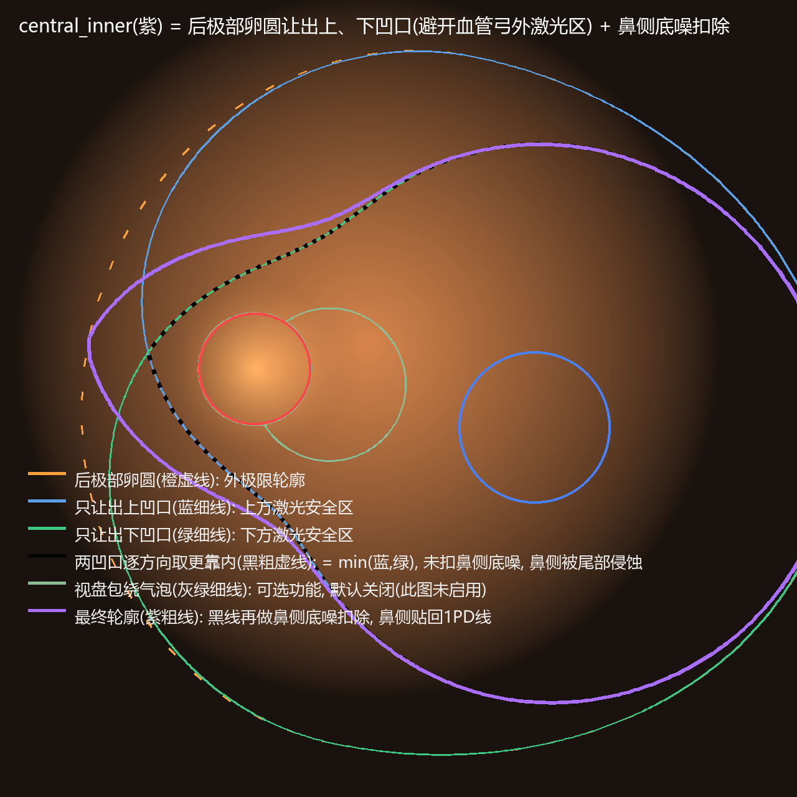
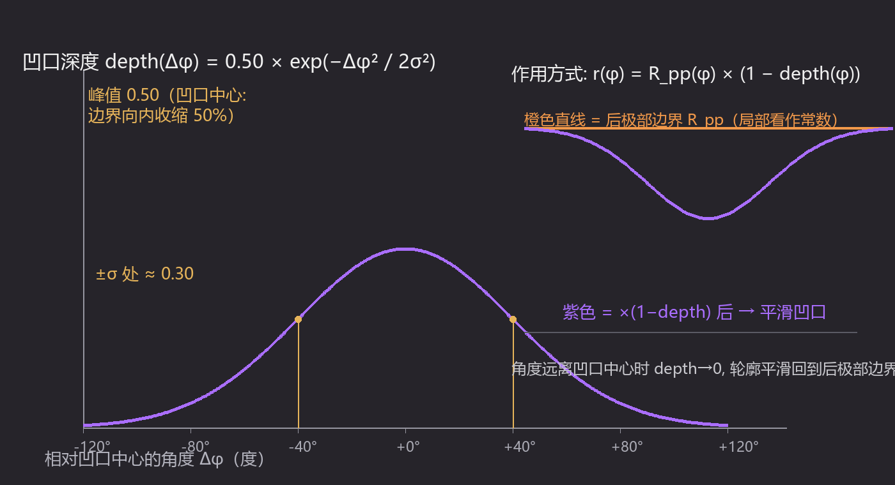
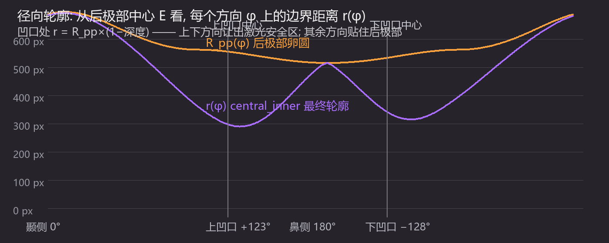
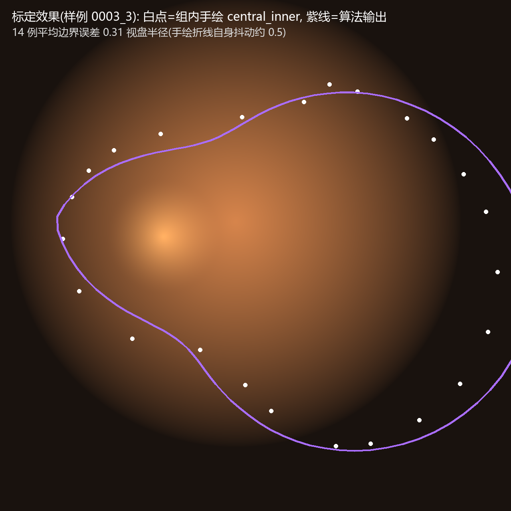

# DR 派生标注结构算法说明

本文档完整解释 LabelMyEye 中糖尿病视网膜病变（DR）光凝标注的五个结构的计算方法：输入如何得到、每个结构如何从输入派生、参数如何标定、以及如何在软件中调整。

- 实现代码：`labelmyeye/dr_geometry.py`（几何计算）、`labelmyeye/auto_annotate.py`（编排）、`labelmyeye/sam_seg.py`（分割）
- 插图由 `scripts/make_algorithm_figures.py` 生成，位于 `docs/figures/`

---

## 1. 总览

```
打开眼底图
   │  AI (DR) 菜单 → 框选视盘 / 框选黄斑
   ▼
MobileSAM 点击分割 → 视盘圆 (Cd, Rd)、黄斑圆 (Cm, Rm)     ← 唯一的输入
   │  两个圆齐备后自动派生
   ▼
┌─ optic                      视盘圆（红）
├─ macular                    黄斑圆（蓝）
├─ macular_area               绿椭圆 —— 相切两圆的血管弓区
├─ posterior_pole_boundary    橙卵圆 —— 后极部边界
└─ central_inner              紫肾形 —— 光凝敏感区
```



**单位约定**：全文 1PD（视盘直径）= 视盘圆的**直径** = 2×Rd（Rd 为视盘半径）。算法内部统一以像素计算，参数以 PD 表述。

---

## 2. macular_area（绿椭圆）—— 相切两圆的血管弓区

解剖学上对应颞侧血管弓围住的区域。构造规则（`tangent_ellipse_two_circles`）：

1. 长轴方向 = 视盘中心 → 黄斑中心连线；
2. 椭圆两个端点**恰好落在**视盘圆的鼻侧极点 ① 和黄斑圆的颞侧极点 ②（因此与两个圆同时相切）；
3. 中心 = ①② 的中点，长半轴 a = |①②| / 2；
4. 短半轴 b 取"恰好把两个圆都完整包进去"的最小值（二分法数值求解）。



这样得到的椭圆是确定性的：同一对输入圆永远得到同一形状，且视觉上与医生手绘的血管弓椭圆一致。

---

## 3. posterior_pole_boundary（橙卵圆）—— 后极部边界

规则：**以绿椭圆的边缘为基准线向外推**，不同方向推的距离不同：

| 方向 | 外扩量 | 说明 |
|------|--------|------|
| 颞侧（黄斑侧） | 2PD | 沿长轴向黄斑方向 |
| 鼻侧（视盘侧） | 1PD | 沿长轴向视盘方向 |
| 上 / 下 | 各 2PD | 沿短轴方向 |

由于颞侧和鼻侧的外扩量不同，结果是一个**不对称卵圆**：由颞半椭圆（半轴 a+2PD, b+2PD）和鼻半椭圆（半轴 a+1PD, b+2PD）在上下顶点拼合而成。参数 `k_pp_temporal / k_pp_nasal / k_pp_vertical` 分别控制三个方向（单位 PD，可随时在 `DR 参数…` 中修改）。



> 注：历史上这个边界曾被画成正圆，但正圆无法同时满足"每个方向距绿椭圆边缘 2PD/1PD"——沿短轴方向它会多出去很多。卵圆才是与画法约定一致的表达。

---

## 4. central_inner（紫肾形）—— 光凝敏感区

这是最核心的结构。它表示**光凝必须避开的区域**：后极部整体，但要在上下两个方向"让开"——因为乳头黄斑束两侧、血管弓之外是允许打激光的区域（PRP 施加处）。

### 4.1 径向轮廓法

以后极部卵圆中心 E 为原点，沿 96 个方向 φ 各计算一个边界距离 r(φ)，连成闭合多边形。整个形状由一个径向函数完全描述：

```
r(φ) = max( R_pp(φ) × (1 − depth(φ)),  r_bubble(φ) )
```

三部分含义如下。



图例：橙虚线 = 后极部卵圆；蓝细线 = 只让出上凹口（上方激光安全区）；绿细线 = 只让出下凹口（下方激光安全区）；黑粗虚线 = 蓝/绿两条线逐方向取更靠内的结果（即 min：上段贴蓝线、下段贴绿线，鼻侧仍被尾部侵蚀约 1.1 视盘半径）；灰绿细线 = 视盘包绕气泡（可选，默认关闭）；紫粗线 = 最终 central_inner——在黑线（min）基础上做鼻侧底噪扣除，鼻侧贴回 1PD 线。

### 4.2 第 1 项：后极部卵圆 R_pp(φ)

E 到后极部卵圆边界在该方向上的距离（解析式：椭圆径向公式，颞半用 a_t、鼻半用 a_n）。它给出"贴住后极部"的外极限。

### 4.3 第 2 项：上下高斯凹口 depth(φ)

在两个方向上各挖一个高斯形凹陷：

```
depth(φ) = max( d_sup × G(φ − a_sup),  d_inf × G(φ − a_inf) )
G(x) = exp( −(x / σ)² / 2 )          σ = 凹口平滑度（默认 40°）
a_sup = +123°, a_inf = −128°          凹口中心（相对轴线，偏向鼻侧）
d_sup = 0.50, d_inf = 0.46            凹口深度（占当地边界半径的比例）
```

r(φ) = R_pp(φ) × (1 − depth(φ))。**σ 越大，凹口与后极部的衔接越平滑**——即用户可调的"凹口平滑度"参数。高斯函数无穷阶连续，保证不会出现折角。

#### 凹口是怎么"画"出来的（单凹口放大）

以过上凹口为例：设 Δφ = φ − 123°（该方向偏离凹口中心的角度）。

1. **深度曲线**：depth(Δφ) = 0.50 × exp(−Δφ²/2σ²)。在凹口正中（Δφ=0）深度恰为 0.50——边界半径被收缩到后极部的 50%；偏离 ±40°（=1σ）时深度只剩 0.30；偏离 ±80°（=2σ）只剩 0.07；±120°（=3σ）之后几乎为 0。
2. **作用方式**：r(φ) = R_pp(φ) × (1 − depth(φ))。离凹口中心越远 depth 越小，轮廓就平滑地回到后极部边界——凹口的"两肩"就是这条高斯曲线的自然延伸，没有任何折角。
3. **两个凹口取 max**：上、下凹口各自算一条 depth 曲线，逐角度取较大者。这样两个凹口互不叠加，间隔处的鼻侧边界保持贴住后极部。



**为什么选高斯**：① 它是无穷阶平滑的（其余弦凹口在衔接处只有一阶连续，肉眼看得到"肩膀"）；② 唯一形状参数 σ 直接对应"平滑度"，临床调整直观；③ 尾部衰减平滑，不会在凹口外产生任何鼓包。



### 4.4 第 3 项：视盘包绕气泡 r_bubble(φ)

以视盘中心为圆心、半径 = Rd + 1PD 的圆（保证视盘边缘外至少 1PD 被包住）。取 max 保证无论凹口多深，**视盘永远被完整包绕至少 1PD**，且鼻侧前端是一个圆润的帽而不是尖角。

### 4.5 鼻侧底噪扣除

两个高斯凹口的尾部会"漏"到鼻方向（约 20% 深度），导致鼻侧 1PD 被侵蚀。因此在鼻极方向扣除一个底噪（`nasal_depth_floor`），使鼻侧画出的边界**恰好**等于 1PD 整。


上图是扣除前后的对比（样例 0003_3）。若不做这一步（青虚线），两个凹口的高斯尾部在鼻极残留约 20% 的收缩深度，鼻侧边界被向内侵蚀约 0.2×a_n——此样例约 102 px ≈ 1.1 视盘半径；扣除后（紫粗线）鼻极处 depth→0，轮廓贴回后极部卵圆（即鼻侧 1PD 外扩线）。下半的径向剖面显示：两条轮廓仅在鼻极附近分离，其余方向完全重合，凹口本身的形状不受影响。

---

## 5. 参数与标定

所有参数默认值来自**组内 14 例手绘标注的自动拟合**（Nelder-Mead 最小二乘，目标为算法轮廓与手绘多边形的双向平均边界距离）：

| 参数 | 默认值 | 含义 | 14 例拟合结果（中位数±std） |
|------|--------|------|------------------------------|
| k_pp_temporal | 2.0 PD | 后极部颞侧外扩 | —（按约定固定） |
| k_pp_nasal | 1.0 PD | 后极部鼻侧外扩 | —（按约定固定） |
| k_pp_vertical | 2.0 PD | 后极部上下外扩 | —（按约定固定） |
| k_mac | 0.85 | 黄斑圆半径 = k_mac × 视盘半径 | 0.84 ± 0.22 |
| ci_depth_sup | 0.50 | 上凹口深度比例 | 0.50 ± 0.06 |
| ci_depth_inf | 0.46 | 下凹口深度比例 | 0.46 ± 0.05 |
| ci_width | 40° | 凹口高斯 σ（平滑度） | 39.5° ± 4.8° |
| ci_angle_sup | 123° | 上凹口中心角 | 122.7° ± 9.7° |
| ci_angle_inf | −128° | 下凹口中心角 | −127.7° ± 12.9° |
| ci_bubble_pd | 0（关闭） | 视盘包绕气泡额外余量 | — |

参数间偏差很小，说明该模型确实复现了手绘的约定。与手绘对比的定量结果（`scripts/validate_against_jsons.py`）：

- 后极部边界：中位对称距离 **0.36 视盘半径**
- central_inner：中位对称距离 **0.39 视盘半径**
- 作为参照：手绘多边形本身顶点间距约 1 视盘半径，即算法已达到手绘噪声水平



**为什么深度/角度有 14 例间的差异还要用统一默认值**：手绘折线只有 24–35 个顶点，顶点间距约 1 视盘半径，单例拟合的抖动大于参数间差异；统一默认值保证全组标注一致性，个体差异交给医生拖点微调。

---

## 6. 编辑与重算

- 视盘 / 黄斑 / 后极部为**原生圆形或 3 点椭圆**：拖中心移动、拖边缘/轴端点改大小与旋转；
- central_inner 为 96 点多边形，支持**平滑变形拖拽**：拖动一点，周边约 1/5 周长的点按高斯权重平滑跟随，不用逐点调整；
- 修改视盘/黄斑圆后按 **Ctrl+3**（或菜单 `AI (DR) → 从视盘/黄斑重算派生结构`）用新圆重新派生三个结构；
- `DR 参数…` 对话框可改全部派生参数，改后同样 Ctrl+3 生效；
- 五个结构共享同一 `group_id`，AI 生成的 `description` 标记为 `auto` / `auto(low-conf)`，便于区分人工与自动。

---

## 7. 代码与脚本索引

| 文件 | 内容 |
|------|------|
| `labelmyeye/dr_geometry.py` | 全部几何：相切椭圆、后极部卵圆、central_inner 径向模型 |
| `labelmyeye/auto_annotate.py` | 点击→分割→圆→五结构的编排 |
| `labelmyeye/sam_seg.py` | MobileSAM ONNX 推理与圆拟合 |
| `scripts/make_algorithm_figures.py` | 生成本文档全部插图 |
| `scripts/calibrate_fit_notch.py` | 凹口参数标定（14 例） |
| `scripts/validate_against_jsons.py` | 与手绘标注的定量对比 |
| `scripts/test_dr_geometry.py` | 几何单元测试 |
