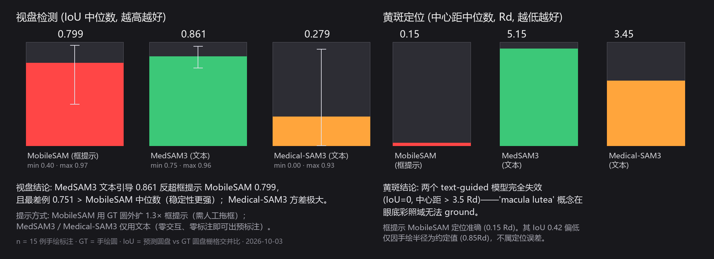

# 实验报告：Text-Guided SAM 模型在 DR 眼底标注数据上的对比评测

**实验编号**: E001–E004 · **日期**: 2026-10-02 ~ 2026-10-03 · **状态**: E001/E002/E003 完成，E004 阻塞

---

## 1. 背景与目的

LabelMyEye 当前采用「人工框选 + MobileSAM 分割」的交互式标注方案。为验证 text-guided
（文本提示、零交互）分割模型能否替代或补充该方案，使用组内手绘标注作为 Ground Truth，
对三类模型做定量对比：

| 实验编号 | 模型 | 架构/来源 | 提示方式 |
|----------|------|-----------|----------|
| E001 | MobileSAM | 轻量 SAM（本工具内置，ONNX CPU） | 框提示（GT 圆外扩 1.3×） |
| E002 | Medical-SAM3 | SAM3 架构 + 医学概念微调（330 概念） | 纯文本 |
| E003 | MedSAM3 | SAM3 + LoRA（Meta SAM3 底座 + 医学概念微调） | 纯文本 |
| E004 | MedCLIP-SAMv2 | CLIP + SAM（MedIA 2025） | 纯文本 |

## 2. 数据与协议

- **数据**: `scripts/calibration_data/` 16 例 FGADR 眼底彩照（1280×1280），其中 15 例含完整
  手绘 optic + macular 标注
- **Ground Truth**: 手绘标注最小二乘拟合圆（optic、macular）
- **提示协议**: E001 使用 GT 圆外扩 1.3× 的框（模拟医生拖框）；E002/E003 使用固定文本提示，
  每结构 3 个候选词按模型置信度择优（候选词见 `scripts/server_run_bench.py`、
  `scripts/run_medsam3_lora.py`）；E004 未运行
- **指标**:
  - `IoU`：预测圆盘 vs GT 圆盘的栅格交并比
  - `中心距`：预测圆心到 GT 圆心距离，单位 = 视盘半径 Rd
- **口径说明**: 手绘 macular 圆半径为组内约定（0.85 × 视盘半径），与模型分割的"实际可见
  黄斑范围"不同。故 **macular 以中心距为主要指标**，IoU 差异不视为定位误差

## 3. 结果



### 3.1 视盘检测（IoU，越高越好）

| 模型 | 中位 IoU | 最差 | 最好 | 中心距中位 (Rd) |
|------|----------|------|------|-----------------|
| MobileSAM（框提示） | 0.799 | 0.402 | 0.970 | 0.10 |
| **MedSAM3（文本）** | **0.861** | **0.751** | 0.960 | **0.06** |
| Medical-SAM3（文本） | 0.279 | 0.001 | 0.934 | 0.94 |

### 3.2 黄斑定位（中心距，Rd，越低越好）

| 模型 | 中位中心距 (Rd) | IoU 中位 |
|------|-----------------|----------|
| MobileSAM（框提示） | **0.15** | 0.424 |
| MedSAM3（文本） | 5.15 | 0.000 |
| Medical-SAM3（文本） | 3.45 | 0.000 |

### 3.3 逐图对比

6 例代表图（MobileSAM 从最差到最好）的目视对比见
`output/benchmark/_compare_grid_3model.png`（本地，含患者影像不入库）。

## 4. 分析

### 4.1 视盘：MedSAM3 文本引导反超框提示（关键发现）

MedSAM3 中位 IoU 0.861 > MobileSAM 0.799，且**最差例 0.751 好于 MobileSAM 的中位数**
（MobileSAM 的短板图 0007_2 = 0.40、1712_3 = 0.41 拖累了整体）。纯文本提示无需任何人工
交互即达到此水平，中心距 0.06 Rd 的定位精度甚至支持直接作为视盘自动预标注。

解释：MedSAM3 的 LoRA 在"optic disc"等概念上有充分的监督信号，且 SAM3 底座的开放词汇
对齐能力强到可以跨模态（CT/MRI 训练 → 眼底彩照推理）迁移视盘这一形态高度一致的结构。

### 4.2 黄斑：两个 text-guided 模型完全失效

IoU = 0、中心距 3.45–5.15 Rd——预测区域整体漂离黄斑。黄斑在眼底彩照中是低对比度、
边界模糊的结构，且训练概念集中缺少眼底域的"macula"标注样本，文本概念无法 ground。
框提示 MobileSAM 的中心距 0.15 Rd 说明：**黄斑检测必须依赖位置先验（人工框选）或
眼底域微调**。

### 4.3 Medical-SAM3 的高方差

IoU 分布 0.001–0.934：约半数图像能ground到视盘（0.9+），其余完全失败。其 330 概念
训练集以 CT/MRI/超声为主，眼底样本缺失导致跨模态对齐不稳定。

## 5. 对标注工具与后续工作的建议

1. **短期**：现有框提示 MobileSAM 流程保留（黄斑必需；视盘亦稳定可用）
2. **中期**：MedSAM3 文本引导可作为**视盘零标注自动预标注**后端集成（服务器 GPU 推理
   → 预填圆 → 医生确认），消除视盘拖框步骤
3. **长期**：用组内 285+ 例标注对 MedSAM3 做眼底域微调，有望同时解决黄斑失效问题，
   并作为论文的模型贡献点
4. **E004 解锁**：任一可访问 Google Drive 的设备下载
   [微调权重](https://drive.google.com/file/d/1jjnZabUlc9_gpcP0d2nz_GNS-EGX0lq5/view)
   转存至可达位置后，用 `scripts/benchmark_models.py --models medclipsamv2 --pred-dir ...` 补测
5. **E003 原始版（Joey-S-Liu）**: 其底座指向 Meta 官方 gated 权重；本次采用
   1038lab/sam3 转存的非 gated 底座（sam3.pt 3.45GB）等价复现。如需官方底座对齐，
   可向 Meta 申请 HF 访问后重跑

## 6. 威胁有效性（Threats to Validity)

- **n=15**: 样本量小，结论以中位数+极差呈现而非均值置信区间；建议扩到全部 285 例后复核
- **圆盘近似**: 用拟合圆盘而非像素级 mask 计算 IoU，对非圆形分割偏差友好
- **提示词选择**: text 模型的候选词为人工选定，不排除存在更优提示词
  （黄斑可尝试 "fovea centralis" 等）——候选词已固化在脚本中可复现
- **单机单跑**: 每模型推理一次，未做随机种子重复（SAM 推理确定性，影响有限）

## 7. 复现

```bash
# E001 MobileSAM（本机 CPU 即可）
python scripts/benchmark_models.py --data scripts/calibration_data --models mobilesam
# E002/E003：服务器推理（见 docs/服务器跑模型教程.md）→ 预测 mask 拉回后
python scripts/benchmark_models.py --data scripts/calibration_data \
    --models medicalsam3,medsam3
# 逐图明细: output/benchmark/results.json
# 服务器 runner: scripts/server_run_bench.py (E002), scripts/run_medsam3_lora.py (E003)
```

## 8. 登记与产物索引

- 台账: [EXPERIMENTS.md](EXPERIMENTS.md)
- 指标汇总图: `experiments/figures/metrics_chart.png`（本文档引用，合成图可入库）
- 三模型目视对比拼版: `output/benchmark/_compare_grid_3model.png`（本地，含患者影像）
- 预测 mask: `output/benchmark/{mobilesam,medicalsam3,medsam3}/`（本地）
